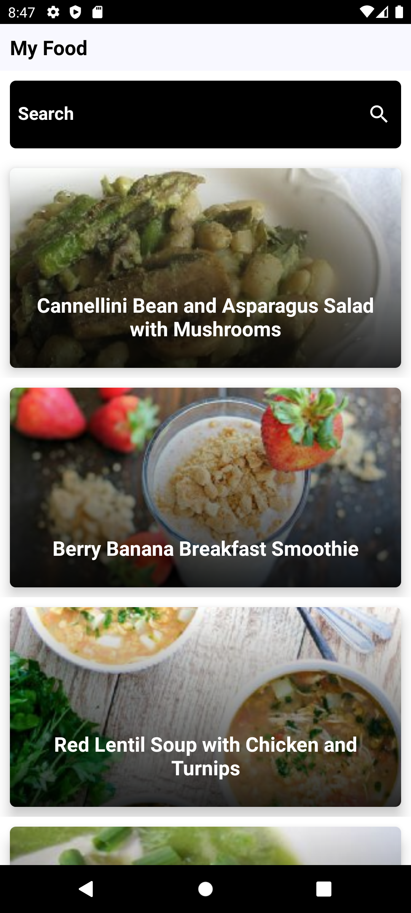
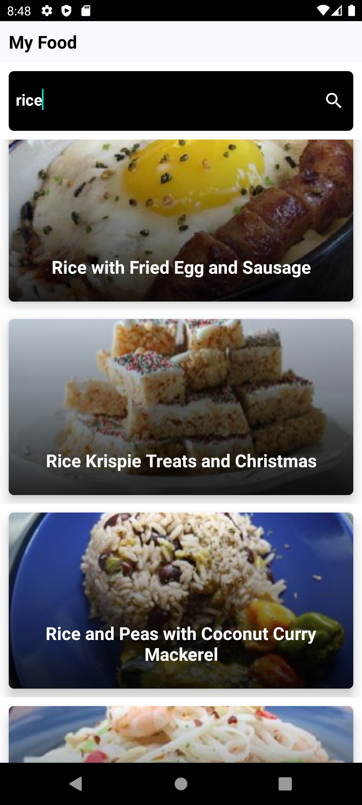

# Spoonacular-Recipe Android
Welcome to SpoonacularRecipes-Android! This Android app offers a delightful culinary experience by harnessing the power of the Spoonacular API to provide a vast collection of recipes at your fingertips. Whether you're a seasoned chef or a cooking enthusiast, explore a world of delicious possibilities with SpoonacularRecipes-Android.

## Features:
Recipe Search: Discover recipes for your favorite dishes by searching for ingredients, cuisine types, or dietary preferences.

Recipe Details: Access detailed information for each recipe, including ingredients, instructions, cooking time, and nutritional information.

Meal Planning: Plan your meals ahead of time by organizing recipes into meal plans for the week.

Random Recipe: Feeling adventurous? Let SpoonacularRecipes-Android surprise you with a random recipe suggestion for inspiration.

User-Friendly Interface: Enjoy a clean and intuitive user interface designed for effortless navigation and a seamless recipe browsing experience.

Experience the joy of cooking with SpoonacularRecipes-Android. Download now and embark on a culinary journey like never before!

[Spoonacular API](https://spoonacular.com/food-api)

## App Images:

